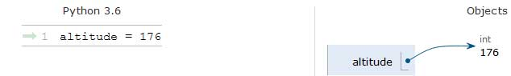

----------------------------------
# Pourquoi Python
----------------------------------

Il existe un très grand nombre de langages de programmation, chacun avec ses avantages et ses inconvénients. Il faut bien en choisir un.
Nous avons alors décidé d’examiner l’offre proposée gratuitement dans la mouvance de l’informatique libre. Il existe dans le monde de l’OpenSource des interpréteurs et des compilateurs gratuits pour toute une série de langages, modernes, performants, portables (c’est-à-dire utilisables sur différents systèmes d’exploitation tels que Windows, Linux, Mac OS …), et fort bien documentés.

Les langages dominants sont C et C++. Ces langages s’imposent comme des références absolues, et tout informaticien sérieux doit s’y frotter tôt ou tard. Ils sont malheureusement très rébarbatifs et compliqués, trop proches de la machine. Leur syntaxe est peu lisible et fort contraignante. La mise au point d’un gros logiciel écrit en C ou C++ est longue et pénible. 

Pour nos débuts dans l’étude de la programmation, il nous semble préférable d’utiliser un langage de plus haut niveau, moins contraignant, à la syntaxe plus lisible. Nous avons finalement décidé d’adopter Python, langage très moderne à la popularité grandissante.

Python est un langage portable, dynamique, extensible, gratuit, qui permet (sans l’imposer) une approche modulaire et orientée objet de la programmation. Python est développé depuis 1989 par Guido van Rossum et de nombreux contributeurs bénévoles.

>>Un logiciel libre (Free Software) est avant tout un logiciel dont le code source est accessible à tous (Open source). Souvent gratuit (ou presque), copiable et modifiable librement au gré de son acquéreur, il est généralement le produit de la collaboration bénévole de centaines de développeurs enthousiastes dispersés dans le monde entier. Son code source étant « épluché » par de très nombreux spécialistes (étudiants et professeurs universitaires), un logiciel libre se caractérise la plupart du temps par un très haut niveau de qualité technique.  

----------------
# Premiers pas
----------------
La programmation est donc l’art de commander à un ordinateur de faire exactement ce que vous voulez, et Python compte parmi les langages qu’il est capable de comprendre pour recevoir vos ordres. Nous allons essayer cela tout de suite avec des ordres très simples concernant des nombres, puisque ce sont les nombres qui constituent son matériau de prédilection. Nous allons lui fournir nos premières « instructions », et préciser au passage la définition de quelques termes essentiels du vocabulaire informatique.
Python est un langage de programmation qui peut être utilisésous plusieurs environnements : Edupython,Pyzo, Spyder, Thonny... Au lycée, nous utiliserons THONNY.
Python présente la particularité de pouvoir être utilisé de plusieurs manières différentes.  
Vous allez d’abord l’utiliser en mode interactif, c’est-à-dire d’une manière telle que vous pourrez dialoguer avec lui directement depuis le clavier. Cela vous permettra de découvrir très vite un grand nombre de fonctionnalités du langage. Dans un second temps, vous apprendrez comment créer vos premiers programmes (scripts) et les sauvegarder sur disque.
**Remarque** : il faut distinguer Python qui est un langage, et Thonny qui est un **environnement intégré de 
programmation** en Python.

-----------------
## Utilisation de base de Thonny
Lorsqu'on lance Thonny la première fois, on découvre une fenêtre avec sa barre de menus usuels, une 
rangée de boutons, et deux panneaux avec des onglets:

*  l'onglet nommé `<untitled>` par défaut correspond à l'éditeur: on pourra le renommer par la suite.
* L'onglet nommé `Shell` correspond à l'interpréteur Python, aussi appelé console Python, qui est un mode interactif direct.


--------------
### Le shell
Le *shell* est donc la zone dans laquelle l'utilisateur interagit/dialogue avec l'interpréteur Python.

--------------------------------
### Dialogue avec l'interpréteur

L'*invite de commande* (ou prompt) `>>>` attend une instruction. 
Par exemple, `>>> 12 + 3*5` ou  `>>> print('Hello World')`, ou encore  `>>> a = 3`  puis `>>> print(a)`

-----------------------
# Calculer avec Python
-----------------------

1.  Tapez les codes suivants dans la console Python. Les valeurs fournies par Python sont-elles justes ?
```python
>>> 5*5
>>> 15 - 4  
```
2. Tapez maintenant les codes suivants. Les valeurs calculées sont-elles justes ? Comment l'ordinateur parvient-il à choisir quelle opération faire d'abord ?
```python
>>> 9*9 + 2
>>> 2 + 9*9
>>> 12 - 2*0.2
>>> - 2*0.2 + 12
```

## Déroulement séquentiel

On remarque qu’on lance des calculs en temps réel et chose importante, l'ordinateur effectue les opérations de façon séquentielle : il ne calcule pas en bloc les expressions.

Au contraire, il définit les priorités et effectue ces calculs avant de lancer la suite de l'évaluation... ça a l'air bête, mais c'est fondamental à comprendre lorsqu'on lit un code.

3. Evaluer de tête ces deux expressions. Donnent-elles le même résultat ?
```python
>>> 3 + 2*3 + 2
>>> (3+2) * (3+2)
```

## Règles de priorité

Retenez donc bien que l'ordinateur n'évalue pas vos expressions au hasard : il utilise les règles qu'on lui a fourni, qui correspondent aux règles de priorité que vous connaissez depuis longtemps :

	Multiplication et division prioritaires sur addition et soustraction
    Ordre d'apparition lorsqu'il faut différencier des multiplications ou des divisions
    Ordre d'apparition lorsqu'il faut différencier des additions ou des soustractions
    L'évaluation d'une expression située dans une parenthèse est toujours prioritaire

## Les différents type de nombres

4. Taper les expressions suivantes: le résultat d'une division.
```python
>>> 15 / 2
>>> 14 / 3 
>>> 14 / 2 
```
5. Réfléchir ensuite sur la réponse donnée. Taper dans la console.
```python
>>> type(14 / 2) 
>>> type(15 / 2) 
>>> type(14 / 3) 
```
### Vocabulaire

Nous venons de voir que Python ne gère pas de la même façon les nombres entiers et les nombres à virugles.

Les __entiers__ sont nommés des _integers_. C'est leur _type_: __`int`__

Les __nombres à virgules__ sont nommées: nombres à virgules flottantes. Leur _type_: __`float`__

Exemples :

    5 est un integer
    5.2 est un float
    5.0 est un float aussi.

Lorsque nous parlerons des structures de données, nous verrons d'ailleurs qu'il faut être très vigilant lorsqu'on travaille avec des nombres à virgules sur un ordinateur. Par exemple : 12.7 / 0.1 qui devrait donner 127.
```python
>>> 3 * 0.1
>>> 3*0.1 - 0.3
>>> 3*0.125 - 0.375
>>> 12.7 / 0.1
```
Pour l'instant, retenez simplement qu'on ne peut pas totalement faire confiance aux résultats incluant des nombres à virgules.

## Bonne pratique pour un code clair

Vous avez peut-être remarqué que plusieurs lignes de calcul possèdent des espacements différents.  
Ceux-ci ne sont pas positionnés au hasard:  

Lorsqu'une expression ne contient que des opérateurs ayant la même priorité, on laisse un espace entre les différents termes.

Expressions correctement écrites :
```python
>>> 25 / 10
>>> 25 + 10 - 5
```
Expressions posant des problèmes de lecture :
```python
>>> 25/10
>>> 25+10+5
```
Lorsqu'une expression ne contient que des opérateurs ayant des priorités différentes, on ne place pas d'espace sur les opérateurs prioritaires:

Expressions correctement écrites:
```python
>>> 10 + 25*5
>>> 25/10 - 5
```

Expressions posant des problèmes de lecture:
```python
>>> 10+25*5
>>> 10 + 25 * 5
>>> 25/10-5
>>> 25 / 10 - 5
```
S'il faut des parenthèses, on ne rajoute pas d'espace au début ou à la fin de l'expression située dans les parenthèses.

L'expression dans la parenthèse est prioritaire sur la multiplication. Cette fois, on ne placera donc pas d'espace entre le `+` mais on en place autour du `*`:

Expressions correctement écrites :
```python
>>>(25+5) * 5
>>> (4+5) * (12+55)
```

Expressions posant des problèmes de lecture :
```python
>>> (25+5)*5
>>> (25 + 5) * 5
>>> ( 25+5 ) * 5
>>> ( 25 + 5 ) * 5
```
Et pour les cas plus complexes ? On fait appel à son bon sens !

## Un nouvel opérateur

6. Taper les expressions suivantes qui illustrent un nouvel opérateur `**` : la puissance.
```python
>>> 3 ** 2
9
>>> 5 ** 4
625
>>> 2 ** 3
...
>>> 2 ** 0
...
```
7. Calculer l'expression suivante `5**2*5**2` : l'opérateur puissance a-t-il le même degré de priorité que la multiplication ? 
Faire le calcul étape par étape dans les trois cas possibles :
- aucune n'est prioritaire
- la multiplication est prioritaire
- la puissance est prioritaire.
Lancer ensuite le code. Qui est prioritaire ? Quelle est alors la forme la plus adaptée à la bonne compréhension de ce que fait le code ?
```python
>>> 5 ** 2 * 5 ** 2 #aucune n'est prioritaire
625
>>> 5 ** 2*5 ** 2 #la multiplication est prioritaire
625
>>> 5**2 * 5**2 #la puissance est prioritaire
625
```
La bonne réponse étant 625, on voit clairement que l'opérateur puissance est prioritaire sur les autres.

La "bonne" façon d'écrire cette ligne est donc :```5**2 * 5**2```

------------
# Variables
------------

Le stockage d’une valeur dans une variable en langage Python se fait avec le signe `=` et avec la syntaxe suivante:
`nom_de_la_variable = valeur`.
>Le nom de la variable ne doit pas:
>- contenir de caractères spéciaux tels que $, #, @, ...  à l’exception du caractère `_` : _underscore_ , touche '8'.
>- contenir d’espace ( d’où l’utilisation des _underscore_ `_` ) 
>- commencer par un nombre  

La __casse__ est significative (les caractères majuscules et minuscules sont distingués).  
_Toto, toto, TOTO sont donc trois variables différentes. Soyez attentifs !_  
Les noms de variables sont des noms que vous choisissez vous-même assez librement. Efforcez-vous cependant de bien les choisir : de préférence assez courts, mais aussi explicites que possible, de manière à exprimer clairement ce que la variable est censée contenir. Par exemple, des noms de variables tels que altitude ou altit conviennent mieux que x pour exprimer une altitude.  

Prenez l’habitude d’écrire l’essentiel des noms de variables en caractères minuscules (y compris la première lettre1). Il s’agit d’une simple convention, mais elle est largement respectée.  

## Affectation (ou assignation)

```python
>>>altitude = 176
>>>altitude
176
```
Il faut bien comprendre qu’il ne s’agit en aucune façon d’une égalité, et que l’on aurait très bien pu choisir un autre symbolisme, tel que `altitude ← 176` par exemple, comme on le fait souvent dans certains pseudo-langages servant à décrire des algorithmes, pour bien montrer qu’il s’agit de relier un contenu (la valeur 176) à un contenant (la variable altitude).
L'instruction d’affectation réalise en réalité plusieurs opérations dans la mémoire de l’ordinateur :

- créer et mémoriser un nom de variable (ici `altitude`) ;
- lui attribuer un type bien déterminé (ici le type `int`) ;
- créer et mémoriser une valeur particulière (ici `176`) ;
- établir un lien (par un système interne de pointeurs) entre le nom de la variable et l’emplacement mémoire de la valeur correspondante.  



## Typage des variables
```python
>>> largeur = 20
>>> longueur = 9.3
>>> surface = largeur * longueur
```

Sous Python, il n’est pas nécessaire de définir le type des variables avant de pouvoir les utiliser. Il suffit d’assigner une valeur à un nom de variable pour que celle-ci soit automatiquement créée avec le type qui correspond au mieux à la valeur fournie. Dans l'exemple, `largeur` et `longueur` ont été créées automatiquement chacune avec un type différent.  
On dit alors que le typage des variables sous Python est un typage __dynamique__, par opposition au typage statique.  

```python
>>> type(largeur)
<class 'int'>
>>> type(longueur)
<class 'float'>
>>> type(surface)
<class 'float'>
```
Mais on peut imposer le typage...
```python
>>> longueur = int(longueur)
>>> type(longueur)
<class 'int'>
>>> longueur
9
>>> largeur=float(largeur)
>>> type(largeur)
<class 'float'>
>>> largeur
20.0
```

### Et le texte ?

Voyons maintenant un autre type de variable...  
On peut demander à l'interpréteur de gérer des chaînes de caractères (_strings_ en anglais).

On doit les fournir entourées de guillemets simples ' ' ou doubles " ".


```python
>>> message = 'Hello World !'
>>> message
'Hello World !'
>>> type(message)
<class 'str'>
```
Sans guillemet, l'interpréteur ne peut pas comprendre que vous voulez lui fournir une chaînes de caractères :
```python
>>> message = Hello World !
  File "<pyshell>", line 1
    message = Hello World !
                        ^
SyntaxError: invalid syntax
```
## Affichage

8. Taper ces instructions ? Quelle est la différence entre les deux versions ?
```python
>>> 'Hello World !'
...
>>> print('Hello World !')
...
```

La première fois, l'expression est juste évaluée : la console affiche donc le résultat entouré de guillemets simples (' et ') pour indiquer qu'il s'agit d'une chaîne de caractères.

La seconde fois, on utilise la fonction `print()` qui permet d'afficher le contenu passé entre parenthèses. La différence ? Uniquement l'absence des guillements simples pour l'instant. Nous verrons néanmoins que la différence est un peu plus subtile...  

On peut se retrouver confronter à un problème... que faire si la chaine de caractères contient elle-même un `'` 

```python
>>> phrase = 'Angellier, l'antre du savoir'
  File "<pyshell>", line 1
    phrase = 'Angellier, l'antre du savoir'
                               ^
SyntaxError: invalid syntax
```
On ouvre avec un `'` mais notre phrase contient un `'`  ! Et l'interpréteur Python ne s'y retrouve plus... 

Une première méthode consiste à utiliser des guillemets double:

```python
>>> phrase = "Angellier, l'antre du savoir"
>>> phrase
"Angellier, l'antre du savoir"
>>> print(phrase)
Angellier, l'antre du savoir
```
Pour la deuxième méthode on utilise l’antislash `\` avant le signe que l'on désire échapper de notre chaine.
```python
>>> phrase = 'Angellier, l\'antre du savoir'
>>> phrase
"Angellier, l'antre du savoir"
>>> print(phrase)
Angellier, l'antre du savoir
```
L’ antislash est un caractère spécial, il sert à coder des fonctions particulières...  
Par exemple le retour à la ligne

```python
>>> identite = 'prenom\nnom\nclasse'
>>> identite
'prenom\nnom\nclasse'
>>> print(identite)
prenom
nom
classe
```

Vous voyez ici la différence évoquée plus tôt.    
Sans le print, l'interpréteur évalue la chaîne mais il donne simplement le contenu.   
Pour activer l'évaluation des caractères __à l'intérieur de la chaîne__, le print est obligatoire.

## Composition 

```python
>>> nom = 'Angellier'
>>> prenom = 'Auguste'
>>> prenom + nom
...
>>> print(prenom + nom)
...
```
On appelle celà la __concaténation__ .

```python
>>> altitude = 176
>>> phrase = 'Le mont Cassel culmine à :' + altitude
Traceback (most recent call last):
  File "<pyshell>", line 1, in <module>
TypeError: can only concatenate str (not "int") to str
```
Observez bien le message d'erreur... l'interpréteur Python ne s'y retrouve plus, veut-on faire une addition ou une concaténation? Il ne peut cocaténer que des chaines (str) entre elles! Il faut donc changer le type de la variable altitude.
```python
>>> altitude = 176
>>> phrase = 'Le mont Cassel culmine à :' + str(altitude)
```
On peut aussi procéder différemment en entrant la variable altitude comme une chaine de caractères!
```python
>>> altitude = '176'
>>> phrase = 'Le mont Cassel culmine à :' + altitude
```

8. Tenter de deviner ce que vont afficher les codes suivants.  
Tapez et exécutez le code une fois que vous pensez avoir la réponse.
```python
>>> 12 + 2
...
>>> 12 * 2
...
>>> '12' + '2'
...
>>> '12' * '2'
...
>>> '12' * 2
...
```

