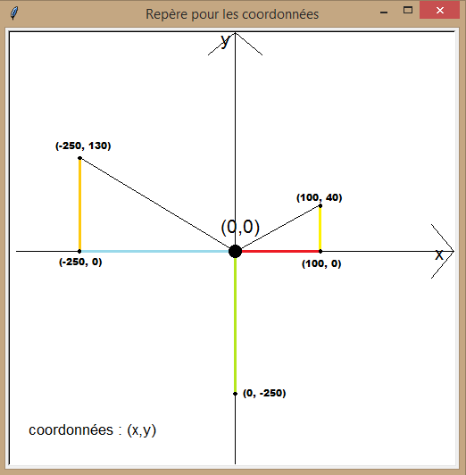
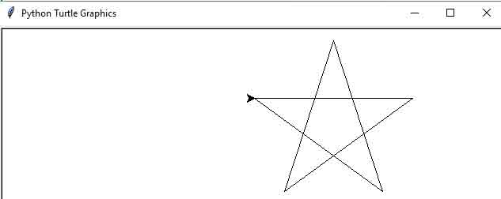

# Module Turtle

Comme nous l'avons vu, l’une des grandes qualités de Python est qu’il est extrêmement facile de lui ajouter de nombreuses fonctionnalités par importation de divers modules.

Pour illustrer cela, et nous amuser un peu avec d’autres objets que des nombres, nous allons explorer un module Python qui permet de réaliser des « graphiques tortue », c’est-à-dire des dessins géométriques correspondant à la piste laissée derrière elle par une petite « tortue » virtuelle, dont nous contrôlons les déplacements sur l’écran de l’ordinateur à l’aide d’instructions simples.

## Quelques fonctions "de base"
Plutôt que de vous donner de longues explications, essayez tout de suite :
1. importer le module turtle
```python
>>> from turtle import *
```
2. On va ouvrir la fenêtre de dessin de turtle
```python
>>> setup()
```
3. On montre la "tortue"
```python
>>> showturtle() # en anglais, 'to show' signifie 'montrer'
```
Vous devez donc voir le curseur de dessin, par défaut au centre de la fenêtre et orienté vers la droite.

4. Faire avancer la tortue de 100 pixels
```python
>>> forward(100) # en anglais, 'to move forward' signifie 'avancer'
```
5. Faire tourner la tortue de 90° vers la gauche
```python
>>> left(90) # en anglais, 'left' signifie 'gauche'
```
6. Tracer un carré de 100 pixels de côté.
écrivez le code d'une fonction permettant de dessiner un carré dont l'utilisateur fournit le côté.

7. On va maintenant déplacer la "tortue" jusqu'à un point dont on va indiquer les coordonnées. Par exemple le point de coordonnées (50;200)

```python
>>> goto(50,200) # en anglais, 'go to' signifie 'aller à'
```
La "tortue" a laissé la trace derrière elle... son crayon est resté 'posé' ! 
On peut la déplacer sans laisser de trace. Il suffit de 'lever' le crayon...
```python
>>> up() # en anglais, 'up' signifie 'en haut'
>>> goto(100,150)
```
8. Puis 'abaisser' le crayon et reculer de 200 pixels
```python
>>> down() # en anglais, 'down' signifie 'en bas'
>>> backward(200)
```
9. On peut aussi connaitre la position de la tortue. Utile quand on l'a pas mal déplacée !
```python
>>> position()
```
10. Revenons au point de départ, et effaçons tout !
```python
>>> home()
>>> clear()
```
En fait, les deux instructions précédentes peuvent être remplacé par une seule:  `reset()`

11. Tester le code
```python
>>> circle(200)
>>> circle(100)
```
Que fait ce code?


## Colorier 
Tout d’abord, il faut savoir que notre tortue n’a pas une, mais deux méthodes de coloriage : une pour tracer et une pour remplir.
### Couleur du tracé
Pour modifier, la couleur de tracé, nous pouvons utiliser la fonction `pencolor(...)` avec la couleur voulue.
```python
>>> forward(100)  #Trace un trait noir de 100px
>>> left(90)  #Tourne de 90°
>>> pencolor("red")  #Change la couleur du tracé à rouge
>>> forward(100)  #Trace un trait rouge de 100px
```
### Couleur de remplissage

De la même manière que pour le tracé, nous pouvons modifier la couleur de remplissage avec la fonction `fillcolor(...)`. En anglais, 'to fill' signifie 'remplir'.
Mais, cette fois c'est un tout petit peu plus compliqué car nous devons préciser ce que l'on veut remplir.
Pour celà, avant de commencer à tracer nous utiliserons la fonction `begin_fill(...)`. 
En anglais, 'to begin' signifie 'commencer'.
De même, une fois la figure finie, il faudra le préciser avec `end_fill(...)` pour que le remplissage devienne actif. 

> remarque: si notre figure n'est pas fermée, en retournant au point de départ,  `end_fill(...)` se charge de la jonction entre la dernière position et le point de départ, avec un trait de la même couleur que la couleur de remplissage.

Voici deux exemples pour comprendre ce fonctionnement :

12. Carré bleu rempli de rouge
```python
>>> fillcolor('red')
>>> begin_fill()  #Précise le début du remplissage
>>> pencolor('blue')  #Change la couleur du tracé à rouge
>>> carre(200)	#On utile notre fonction carre() qui dessine un carré de 200 pixels de côté
>>> end_fill()  #Précise la fin du remplissage
```
13. Début d'octogone pas fermé,...en vert rempli de jaune
```python
>>> pencolor("green")  #Change la couleur de traçage à vert
>>> fillcolor("yellow")  #Change la couleur de remplissage à jaune
>>> begin_fill()  #Précise le début du remplissage
>>> forward(75)
>>> left(45)
>>> forward(75)
>>> left(45)
>>> forward(75)
>>> left(45)
>>> forward(75)
>>> end_fill()  #Précise la fin du remplissage
```

>remarque 1: regardez bien la 'tortue'. En effet, la couleur de ses contours correspond à la couleur de tracé tandis que la couleur de son intérieur correspond à la couleur de remplissage.
>remarque 2: La fonction `color()` nous permet de faire d’une pierre deux coups.  `color('red', 'yellow')`  est équivalent à `pencolor('red')` et de `fillcolor('yellow)`. Si elle a une seule valeur, alors la couleur de tracé et celle de remplissage prendront toutes deux celle-ci... `color('green')` est donc équivalent de à `pencolor('green')` et
`fillcolor('green')`

14. Atelier dessin: dessiner une étoile à 5 branches régulière.

15. Colorier l'étoile dans la couleur de votre choix.

>Vous avez du remarquer qu'à plusieurs reprises tout au long de ce cours, nous avons répété plusieurs fois des instructions strictement identiques... ce qui est quelque peu rébarbatif! Nous allons donc vite utiliser... les boucles!