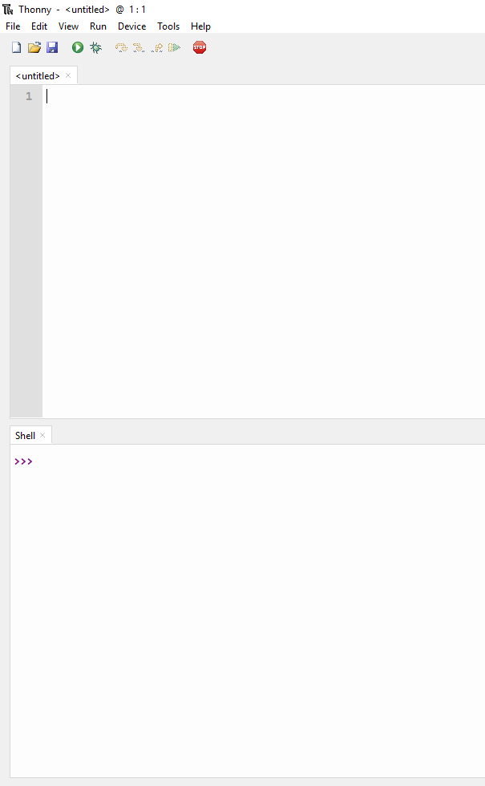
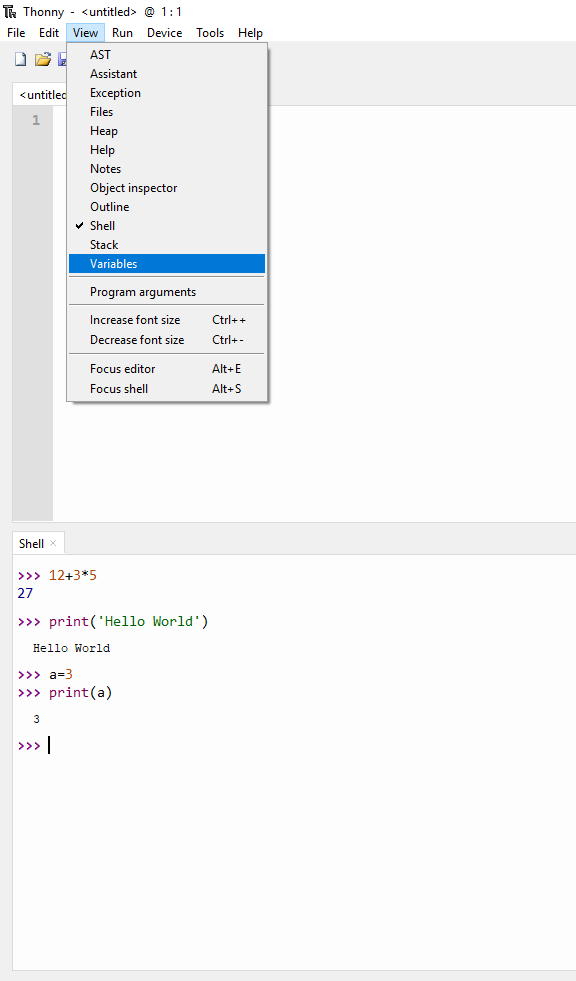
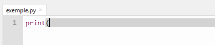
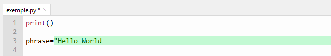
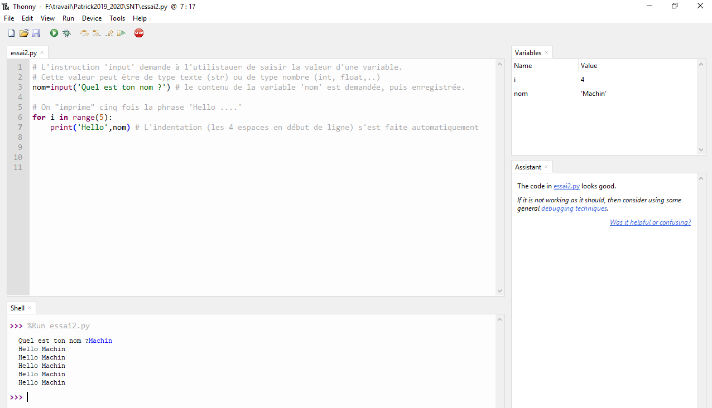
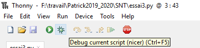
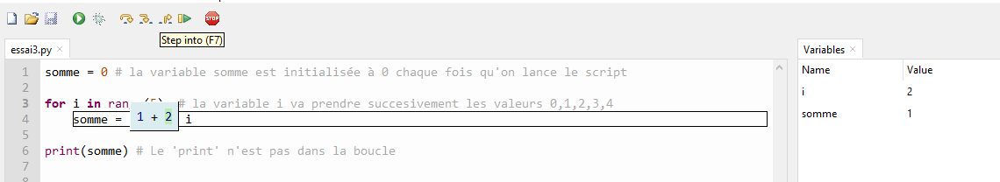

# Thonny

Thonny est un *environnement de développement intégré* (EDI ou IDE en anglais pour 
*Integrated Development Environment*) qui a été particulièrement bien conçu pour les programmeurs 
débutant en Python.

La dernière version disponible à ce jour (avril 2019) est la 3.1.2.

Sites officiels :

* [Thonny](https://thonny.org)
* Wiki [Wiki](https://github.com/thonny/thonny/wiki)

**Remarque** : il faut distinguer Python qui est un langage, et Thonny qui est un **environnement intégré de 
programmation** en Python.

## Utilisation de base
Lorsqu'on lance Thonny la première fois, on découvre une fenêtre avec sa barre de menus usuels, une 
rangée de boutons, et deux panneaux avec des onglets:

*  l'onglet nommé `<untitled>` par défaut correspond à l'éditeur: on pourra le renommer par la suite.
* L'onglet nommé `Shell` correspond à l'interpréteur Python, aussi appelé console Python, qui est un mode interactif direct.

## Le shell
Le *shell* est donc la zone dans laquelle l'utilisateur interagit/dialogue avec l'interpréteur Python.

### Dialogue avec l'interpréteur

L'*invite de commande* (ou prompt) `>>>` attend une instruction. 
Par exemple, `>>> 12+3*5` ou  `>>> print('Hello World')`, ou encore  `>>> a=3`  puis `>>> print(a)`

### L'explorateur de variables

* Il est intéressant d'avoir une vue sur les variables définies en cours de programmation. Pour cela Thonny offre la possibilité d'ouvrir un nouveau panneau (onglet `Variables`)
* Pour l'obtenir, cliquer sur ' *View* ' et cocher ' *Variables* '
* un nouveau panneau  apparaît sur la droite qui présente les variables en donnant leur nom et leur valeur
* dans le shell ajouter une définition d'une nouvelle variable, puis modifier sa valeur. Observer dans la vue sur les variables

### Facilités de dialogue 

* Dans le shell, appuyer sur la flèche haut : on a ainsi accès à l'historique, ce qui permet d'éviter de retaper les mêmes instructions.
* La complétion automatique ,via la touche TAB, est très utile aussi lorqu'on doit entrer des noms de variables ou d'instructions plus ou moins longues (sera revue avec l'éditeur)
* Possibilité de «nettoyer» le shell via clic droit option `clear`

## L'éditeur
L'éditeur permet la rédaction de *scripts* (fichiers contenant du code Python). Ces scripts peuvent être exécutés et utilisés dans le shell

### Avantages de l'éditeur Thonny

* Une sauvegarde est effectuée à chaque exécution du script ( si le script vient d'être créé dans l'onglet nommé `<untitled>`, une boîte de dialogue apparait pour demander un nom de script. Si le nom donné ne contient pas l'extension `.py` Thonny la rajoute.)
* Coloration syntaxique :
  * des mots clés du langage ( `if`, `for`, `while`, `True`, `False` ,`def`, ...)
  * des constantes littérales (couleurs distinctes pour nombres et chaînes de caractères)
  * permet de mettre en évidence un 'délimiteur' ouvert mais non fermé (parenthèses, guillemets, chaines de caractères,listes, ...)

   
* On peut rajouter des commentaires avec le symbole `#`
* Indentation automatique lorsque nécessaire
* Complétion automatique avec la touche TAB
* Visualisation de la portée des variables

### Exécution d'un script, plusieurs possibilités

* via le bouton flèche verte
* via la touche F5
* via le menu `Run/Run current script`

## 'Debugger', ou 'mode pas à pas'
Lors de l'execution d'un script, on peut l'executer 'pas à pas' et ainsi visualiser l'effet de chaque instruction sur chaque variable.
* Pour activer ce mode, il faut cliquer sur le petit 'bug' (punaise - l'insecte - en anglais), situé à côté du bouton 'flèche verte'. On peut aussi l'activer via la combinaison 'Ctrl+F5'.

* Une fois le mode actif, plusieurs icones (flèches) deviennent actives: 
 * Step Over: On n'entre pas dans les blocs. Permet de chercher rapidement où se trouve le problème.
 * Step Into: on entre dans chaque bloc et on décompose ce qu'il s'y passe. Permet d'avoir une vision 'fine' de l'effet sur les variables
 * Step Out: pour ressortir d'un bloc
 * Resume: finir le script

