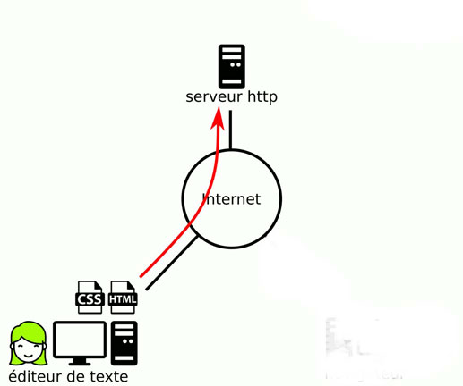
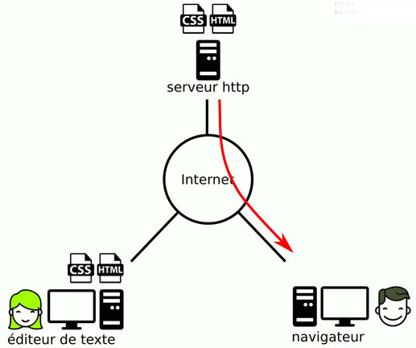

Client-serveur : mise en ligne d'un site web
---
 Prenons le cas où Alice souhaite mettre en ligne un petit site web personnel qui sera hébergé chez son fournisseur d'accès à Internet.  
 Son site, très basique, sera composé uniquement d'une seule page.  
 Voilà ci-dessous les grandes étapes pour y parvenir.

Alice ouvre un éditeur de texte puis écrit son texte qu'elle structure pour qu'il respecte le langage HTML.  
- **Cela lui donne un fichier HTML.**  

Toujours avec son éditeur de texte, elle indique la mise en page qu'elle souhaite effectuer en respectant le langage CSS.  
- **Cela lui donne un fichier CSS.**  

Elle dispose maintenant de deux fichiers : un fichier HTML (son texte structuré) et un fichier CSS (sa mise en page).
  

- **Elle envoie une copie - en utilisant Internet - de ces deux fichiers sur son serveur http hébergé par son fournisseur d'accès à Internet.**  

  

- **Son ami Edgar peut alors consulter le site d'Alice : dans ce cas le navigateur d'Edgar récupère une copie des deux fichiers HTML et CSS auprès du serveur http avant d'afficher le texte d'Alice.**  

Si vous avez étudié l'historique du web, vous remarquez qu'on a bien besoin des trois logiciels qui avaient été conçus dès le départ de l'invention du web par Tim Berners-Lee :
*un éditeur pour la création des fichiers HTML et CSS,
*un serveur http pour la mise à disposition des fichiers HTML et CSS sur Internet,
*un navigateur pour pouvoir consulter les fichiers HTML et CSS mis à disposition par le serveur http.

Petite remarque supplémentaire concernant le mot "serveur".  
Il s'agit tout simplement d'un logiciel.  
Mais, par extension, ce mot désigne aussi l'ordinateur sur lequel est installé le logiciel.  
