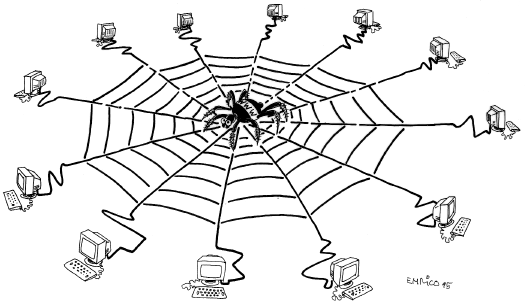

-----------------
# Le monde du Web
-----------------

Le monde du Web est construit sur la métaphore de la toile. Chacun des fils seraient la représentation des hyperliens, là où chaque point d'ancrage de la toile serait alors le représentant d'une page web.  

  

Le lien est un composant essentiel de la structure des documents. Il offre la possibilité de naviguer vers une autre ressource, et de mettre en relation des ressources similaires ou complémentaires. 

Pour résumer Internet est le réseau informatique mondial, c’est l’infrastructure globale, basée sur le protocole IP, et sur laquelle s’appuient de nombreux autres services. Dont le web. 

